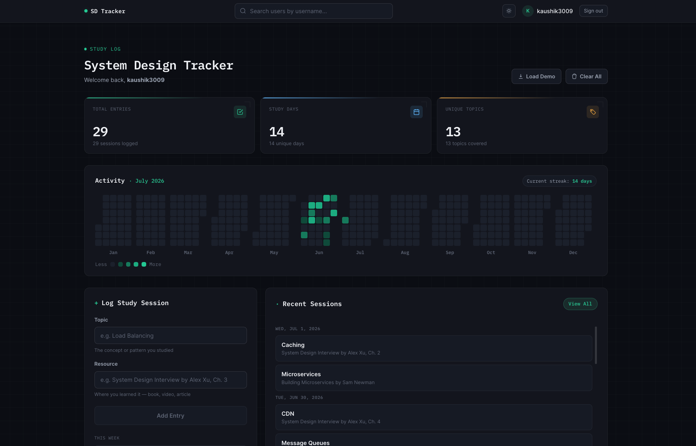
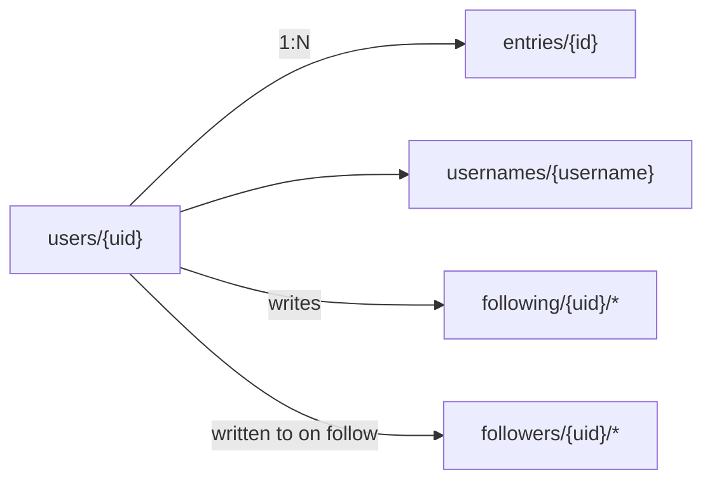

<div align="center">

# System Design Tracker

A study log and streak tracker for system design prep — the LeetCode heatmap, for the part of interview prep that doesn't have one.


[Live Demo](https://swe-leet.vercel.app) 

</div>

<!-- Screenshot: drop a real one in /docs and swap the src below before publishing -->
<p align="center">
  
</p>

---

## Table of Contents

- [Why](#why)
- [Features](#features)
- [Tech Stack](#tech-stack)
- [Data Model](#data-model)
- [Running It Yourself](#running-it-yourself)
- [Roadmap](#roadmap)
- [License](#license)

## Why

LeetCode's submission heatmap is the reason I was consistent at Data Structure and Algorithms. After the initial friction wore off, the streak itself became the motivation. System design prep has no equivalent: you read a chapter or sketch an architecture, and there's no tangible record it happened. I'd study hard for a week, take a few days off, and lose track of what I'd already covered. 

This app applies the same feedback loop: log a session, watch the heatmap fill in, and the entry log count pile up.

## Features

| Feature | Description |
|---|---|
| **Activity heatmap** | Year-view of study activity, GitHub-contributions style |
| **Weekly progress** | Per-day session counts, Mon–Sun, against a weekly goal |
| **Stats** | Total entries, study days, unique topics covered |
| **Social** | Search by username, follow others, view their heatmap |

## Tech Stack

- **Framework:** Next.js
- **Styling:** Tailwind CSS
- **Auth & Database:** Firebase Authentication, Firestore
- **Hosting:** Vercel

No custom backend —> the frontend talks to Firebase directly.

## Data Model



`entries` are queried per-user, ordered by `createdAt`, and aggregated client-side into the heatmap and weekly chart.

## Running It Yourself

<details>
<summary><strong>Local setup, Firebase config, and deployment</strong> (click to expand)</summary>

### Prerequisites

Node 18+, a Firebase project.

### Install

```bash
git clone https://github.com/kaushik-3009/swe-leet.git
cd swe-leet
npm install
```

Create `.env.local`:

```
NEXT_PUBLIC_FIREBASE_API_KEY=...
NEXT_PUBLIC_FIREBASE_AUTH_DOMAIN=...
NEXT_PUBLIC_FIREBASE_PROJECT_ID=...
NEXT_PUBLIC_FIREBASE_STORAGE_BUCKET=...
NEXT_PUBLIC_FIREBASE_MESSAGING_SENDER_ID=...
NEXT_PUBLIC_FIREBASE_APP_ID=...
```

```bash
npm run dev
```

Open [http://localhost:3000](http://localhost:3000), create an account, start logging.

### Firebase Setup

1. [Create a Firebase project](https://console.firebase.google.com)
2. Enable **Authentication** → Email/Password
3. Create a **Firestore Database** (test mode is fine to start)
4. Add a **Web App** and copy the config into `.env.local`
5. Deploy these Firestore rules:

```
rules_version = '2';
service cloud.firestore {
  match /databases/{database}/documents {
    match /users/{uid} {
      allow read: if true;
      allow write: if request.auth != null;
    }
    match /usernames/{username} {
      allow read: if true;
      allow write: if request.auth != null;
    }
    match /entries/{id} {
      allow read: if true;
      allow write: if request.auth != null;
    }
    match /following/{uid}/{document=**} {
      allow read: if request.auth != null;
      allow write: if request.auth.uid == uid;
    }
    match /followers/{uid}/{document=**} {
      allow read: if request.auth != null;
      allow write: if true;
    }
  }
}
```

> **Privacy note:** `users`, `usernames`, and `entries` are readable by anyone with a Firestore client, not just through the app UI — this is what makes the follow/heatmap feature work without a backend. It also means entry content (topic + resource text, not just the heatmap) is public for every account. To make logs private-by-default with an opt-in public heatmap, split entry metadata (date + count, for the heatmap) from entry content (topic/resource) into separate documents with separate read rules.

6. Create a composite index on `entries`: `userId` (ASC) + `createdAt` (DESC). The app links directly to the index-creation page if Firestore reports it's missing.

### Demo Data

Visit `/seed` after deploying to create 5 demo users with 60 days of study history each — useful for testing search and follow without manually creating accounts.

### Deployment

Push to GitHub, import the repo on [Vercel](https://vercel.com), add the Firebase env vars, deploy.

</details>

## Roadmap

- [ ] Editable/deletable entries from the dashboard
- [ ] Per-user weekly goal configuration
- [ ] Export study history as CSV

## License

MIT — see [`LICENSE`](./LICENSE).
